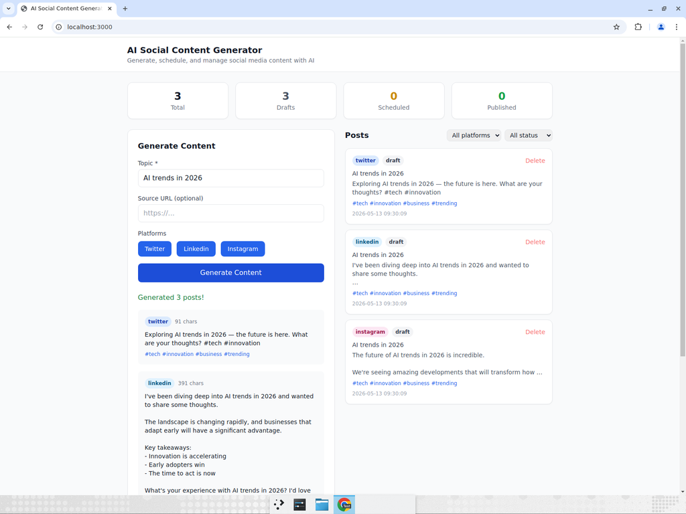
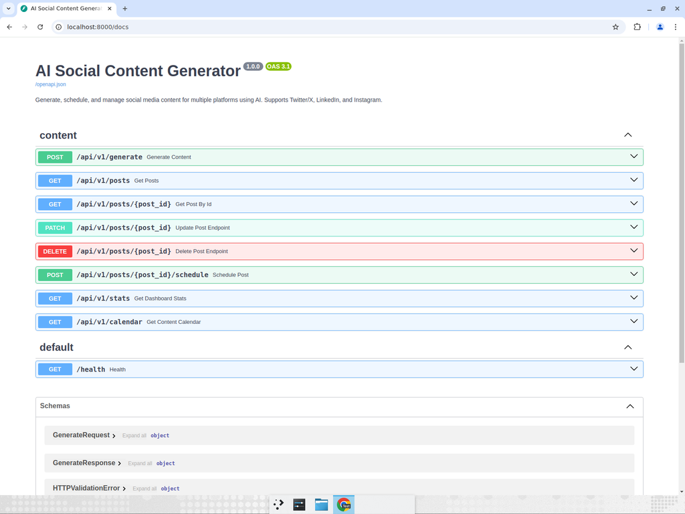

# AI Social Content Generator

[](https://github.com/adrianherediaportfolio/ai-social-content-generator/actions)
[](https://python.org)
[](https://react.dev)
[](LICENSE)

An AI-powered social media content generator and scheduler. Create optimized posts for **Twitter/X**, **LinkedIn**, and **Instagram** from a single topic using OpenAI. Includes a React dashboard for managing, editing, and scheduling content.

## Screenshots

### Dashboard with Generated Content


### API Documentation (Swagger)


## Features

- **Multi-Platform Generation** — One topic generates tailored posts for Twitter (280 chars), LinkedIn (professional), and Instagram (hashtag-rich)
- **AI-Powered** — Uses OpenAI GPT-4o-mini for platform-optimized content
- **Template Fallback** — Works without an OpenAI key using built-in templates
- **React Dashboard** — Modern UI for generating, viewing, filtering, and managing posts
- **Content Calendar** — View scheduled posts by month
- **Full CRUD API** — Create, read, update, delete, and schedule posts
- **Statistics Dashboard** — Track total, draft, scheduled, and published posts
- **Docker Compose** — One-command deployment for the full stack

## Architecture

```
ai-social-content-generator/
├── backend/               # Python FastAPI REST API
│   ├── src/
│   │   ├── api/routes.py  # API endpoints
│   │   ├── core/          # Config & database
│   │   ├── models/        # Pydantic schemas
│   │   └── services/      # AI content generation
│   └── tests/
├── frontend/              # React + Vite + TailwindCSS
│   └── src/
│       └── App.jsx        # Main dashboard component
├── docker-compose.yml
└── .env.example
```

## Quick Start

### Backend

```bash
cd backend
python -m venv .venv
source .venv/bin/activate
pip install ".[dev]"

# Configure (optional — works without OpenAI key)
cp ../.env.example ../.env
# Edit .env and add your OPENAI_API_KEY

uvicorn src.main:app --reload
```

API docs: `http://localhost:8000/docs`

### Frontend

```bash
cd frontend
npm install
npm run dev
```

Dashboard: `http://localhost:5173`

### Docker (Full Stack)

```bash
cp .env.example .env
docker compose up -d
```

- Frontend: `http://localhost:3000`
- Backend API: `http://localhost:8000/docs`

## API Endpoints

| Method | Endpoint | Description |
|--------|----------|-------------|
| `POST` | `/api/v1/generate` | Generate content for multiple platforms |
| `GET` | `/api/v1/posts` | List posts (filter by platform/status) |
| `GET` | `/api/v1/posts/{id}` | Get a specific post |
| `PATCH` | `/api/v1/posts/{id}` | Update a post |
| `DELETE` | `/api/v1/posts/{id}` | Delete a post |
| `POST` | `/api/v1/posts/{id}/schedule` | Schedule a post |
| `GET` | `/api/v1/stats` | Dashboard statistics |
| `GET` | `/api/v1/calendar` | Content calendar view |
| `GET` | `/health` | Health check |

### Generate Content

```bash
curl -X POST http://localhost:8000/api/v1/generate \
  -H "Content-Type: application/json" \
  -d '{"topic": "AI trends in 2026", "platforms": ["twitter", "linkedin", "instagram"]}'
```

## Running Tests

```bash
# Backend
cd backend
pytest tests/ -v

# Frontend
cd frontend
npm run build  # Verifies the build succeeds
```

## Tech Stack

**Backend:**
- [FastAPI](https://fastapi.tiangolo.com) — Async Python web framework
- [OpenAI API](https://openai.com) — Content generation
- [SQLite](https://sqlite.org) + [aiosqlite](https://github.com/omnilib/aiosqlite) — Database
- [Pydantic](https://pydantic.dev) — Data validation

**Frontend:**
- [React 18](https://react.dev) — UI framework
- [Vite](https://vitejs.dev) — Build tool
- [TailwindCSS](https://tailwindcss.com) — Utility-first CSS

## License

MIT — see [LICENSE](LICENSE).
